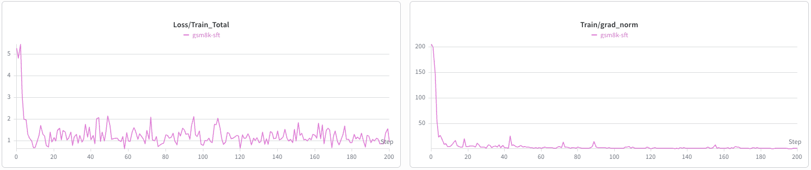
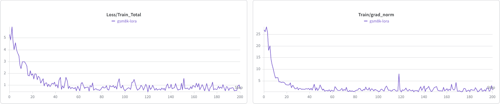

# Fine-Tuning DiffusionGemma

## Introduction

DiffusionGemma is a block-diffusion language model. Unlike an autoregressive (AR)
model that generates one token at a time from left to right, a block-diffusion model fills in
a block of response tokens (a canvas) by iteratively denoising the canvas. The canvas
starts as uniform-random vocabulary tokens and is refined over several passes, conditioned
on the prompt.

This guide covers Supervised Fine-Tuning (SFT) of the DiffusionGemma 26B-A4B model,
which is a mixture-of-experts (MoE) model with 26B total and approximately 4B active parameters,
using NeMo AutoModel with both full fine-tuning and Low-Rank Adaptation (LoRA).

The released checkpoint is available on the Hugging Face Hub:
[`google/diffusiongemma-26B-A4B-it`](https://huggingface.co/google/diffusiongemma-26B-A4B-it).

### Workflow Overview

| Step | What You Do |
| :--- | :--- |
| 1. Install | Install NeMo AutoModel using uv or a container |
| 2. Configure | Select an example YAML configuration file for full SFT or LoRA, and specify your dataset |
| 3. Train | Launch training with `torchrun` on eight GPUs |
| 4. Inspect | Read the training and diffusion loss curves |

## Model Overview

DiffusionGemma combines a causal encoder and a bidirectional decoder on a shared backbone:

- **Encoder**: Reads the clean prompt and response sequence with causal attention and
  builds a read-only KV cache.
- **Decoder**: Denoises the response canvas. Attention is bidirectional within the
  selected canvas block and block-causal across blocks: each block attends to the clean
  prompt plus earlier clean response blocks in the encoder KV.

The `DiffusionGemmaSFTRecipe` implements the following training mechanics:

- **Uniform-random corruption**: For each example, a corruption level
  $t \sim U(\text{eps}, 1)$ is sampled (`dllm.eps` defaults to `0.001`). Supervised
  canvas positions are independently replaced with uniform random vocabulary tokens.
  There is no `[MASK]` token.
- **One canvas per step**: The decoder still sees the full response window, but the
  diffusion loss is restricted to one randomly chosen response block per example.
- **Flat diffusion loss**: Mean cross-entropy over all supervised tokens in that
  selected block (corrupted and clean), with no $1/t$ reweighting.
- **Encoder AR loss**: The shared backbone is also trained as a causal LM on the clean
  full sequence (`encoder_loss_weight` defaults to `1.0`). Total loss is diffusion CE
  plus encoder AR CE.
- **Self-conditioning**: Two-pass Analog-Bits self-conditioning. Pass 1 always runs
  without gradients. With probability `self_conditioning_p` (default `0.5`), each
  example feeds those logits into pass 2.
- **Frozen router**: The MoE router stays frozen. Full SFT trains experts and dense
  layers. LoRA adapts attention and dense-MLP linears only. The EP-sharded experts
  are not adapted.
- **Single-turn SFT**: `mask_history: true` supervises only the final response turn.

The example recipes run with Fully Sharded Data Parallel 2 (FSDP2) and expert
parallelism (EP=8), mixed precision (FP32 master weights and BF16 compute), and a
canvas and block size of 256.

## Launch Training

DiffusionGemma SFT runs on a single eight-GPU node (EP=8). Two example configuration files
are provided in the `examples/dllm_sft/` directory:

| Configuration File | Description |
| :--- | :--- |
| [`diffusion_gemma_sft.yaml`](../../../examples/dllm_sft/diffusion_gemma_sft.yaml) | Full fine-tuning on the [GSM8K](https://huggingface.co/datasets/openai/gsm8k) dataset |
| [`diffusion_gemma_lora.yaml`](../../../examples/dllm_sft/diffusion_gemma_lora.yaml) | LoRA fine-tuning (attention and dense-MLP linears; rank 16) |

Both configurations automatically pull the checkpoint from the Hugging Face Hub
(`google/diffusiongemma-26B-A4B-it`). Because the GSM8K dataset is consumed in the OpenAI
chat-messages format, you must generate the JSONL file (`./gsm8k_chat_train.jsonl`) before
launching training:

```bash
python examples/dllm_sft/prep_gsm8k.py
```

The recipes also set `chat_template` to
[`diffusion_gemma_chat_template.jinja`](../../../examples/dllm_sft/diffusion_gemma_chat_template.jinja).
The released DiffusionGemma chat template has no Jinja generation tags, so without this
copy the supervised region would start at the model turn header and teach the model to
re-emit it.

To run full SFT:

```bash
torchrun --standalone --nproc-per-node=8 \
    examples/dllm_sft/finetune.py \
    -c examples/dllm_sft/diffusion_gemma_sft.yaml
```

To run LoRA:

```bash
torchrun --standalone --nproc-per-node=8 \
    examples/dllm_sft/finetune.py \
    -c examples/dllm_sft/diffusion_gemma_lora.yaml
```


## Training Results

The following figures show the SFT and LoRA training curves on the GSM8K dataset for the
first 200 steps.

SFT training curves:



LoRA training curves:


