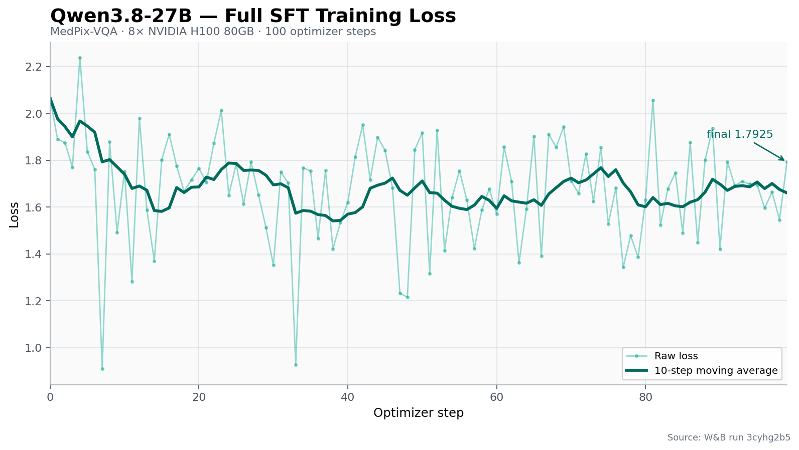
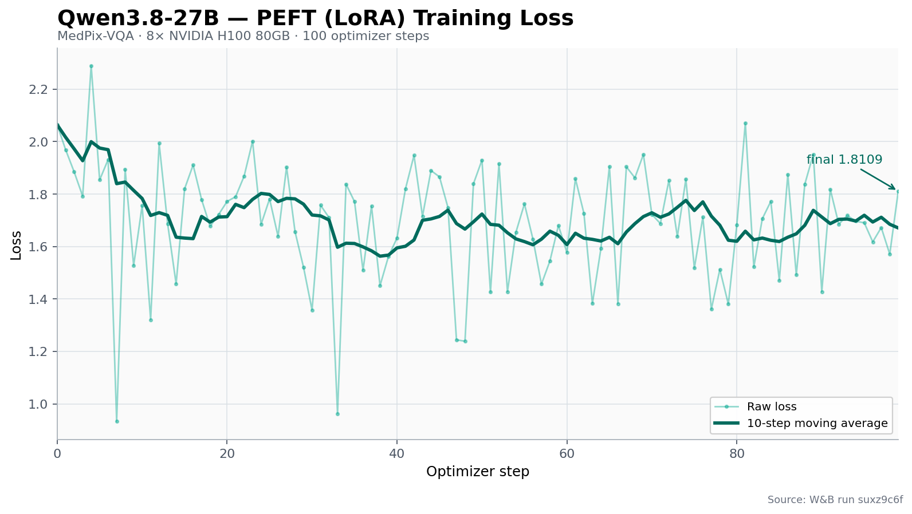

[Qwen/Qwen3.8-27B](https://huggingface.co/Qwen/Qwen3.8-27B) is a dense 27B
native vision-language model for text, image, and video inputs. Its language
backbone has 64 layers and alternates Gated DeltaNet linear-attention blocks
with gated full-attention blocks. The checkpoint uses a 5,120-dimensional
hidden state, a 17,408-dimensional feed-forward layer, and a native context
length of 262,144 tokens.

NeMo AutoModel loads Qwen3.8-27B through the existing native
`Qwen3_5ForConditionalGeneration` implementation because the Qwen3.6-27B and
Qwen3.8-27B checkpoint configs have the same model architecture and dimensions.

## Install Dependencies

From a current NeMo AutoModel checkout, install the VLM and Qwen media
dependencies:

```bash
uv sync --locked --all-groups --extra vlm-media
```

## Data

Both recipes fine-tune on
[mmoukouba/MedPix-VQA](https://huggingface.co/datasets/mmoukouba/MedPix-VQA),
a medical visual-question-answering dataset with train and validation splits.
The vision tower is frozen, while the language model remains trainable.

For details on adapting another multimodal dataset, see the
[Multi-Modal Dataset Guide](/datasets/multi-modal-dataset).

## Run Full SFT

The [full SFT recipe](https://github.com/NVIDIA-NeMo/Automodel/blob/main/examples/vlm_finetune/qwen3_8/qwen3_8_27b.yaml)
uses BF16, FSDP2 data parallelism, activation checkpointing, and a global batch
size of eight:

```bash
uv run automodel --nproc-per-node=8 \
  examples/vlm_finetune/qwen3_8/qwen3_8_27b.yaml
```

## Run LoRA

The [LoRA recipe](https://github.com/NVIDIA-NeMo/Automodel/blob/main/examples/vlm_finetune/qwen3_8/qwen3_8_27b_lora.yaml)
trains rank-8 adapters and excludes the vision tower, image encoder, audio
modules, and language-model head from adapter injection:

```bash
uv run automodel --nproc-per-node=8 \
  examples/vlm_finetune/qwen3_8/qwen3_8_27b_lora.yaml
```

## Training Results

The following loss curves come from 100-step runs on one node with eight
NVIDIA H100 80GB GPUs. Both runs used the checked-in MedPix-VQA recipes with
Weights & Biases logging enabled; validation was disabled for these curve-only
runs. The plots show every recorded training-loss value and a trailing 10-step
moving average. Full SFT moved from 2.0644 to 1.7925 (minimum 0.9088), while
PEFT moved from 2.0639 to 1.8109 (minimum 0.9327).

**Full SFT** ([Weights & Biases run](https://wandb.ai/Nemo-automodel/automodel-pr-validation/runs/3cyhg2b5))



**PEFT (LoRA)** ([Weights & Biases run](https://wandb.ai/Nemo-automodel/automodel-pr-validation/runs/suxz9c6f))


